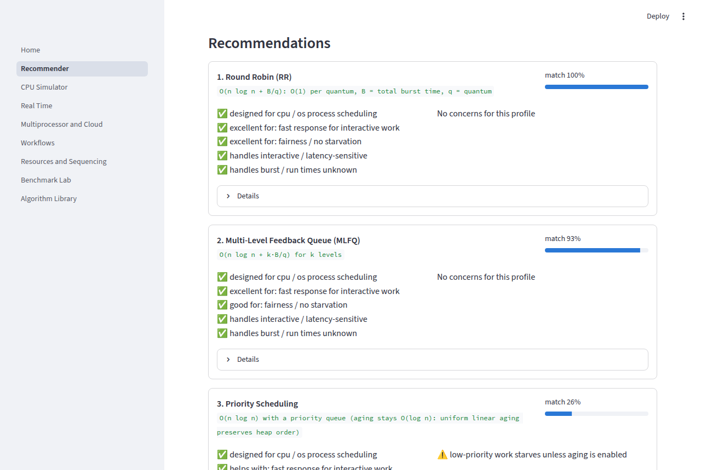
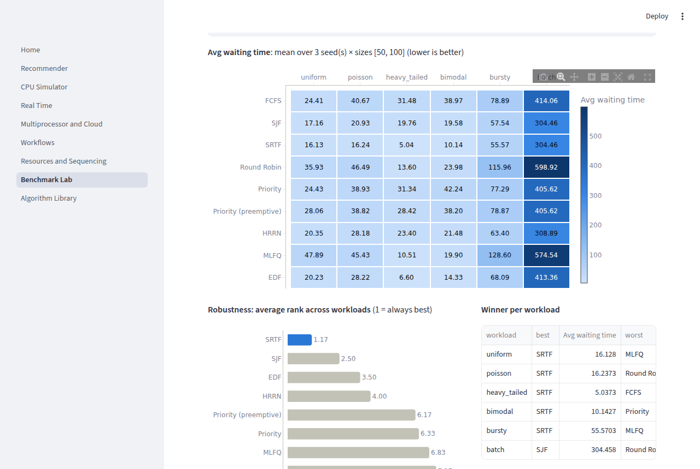
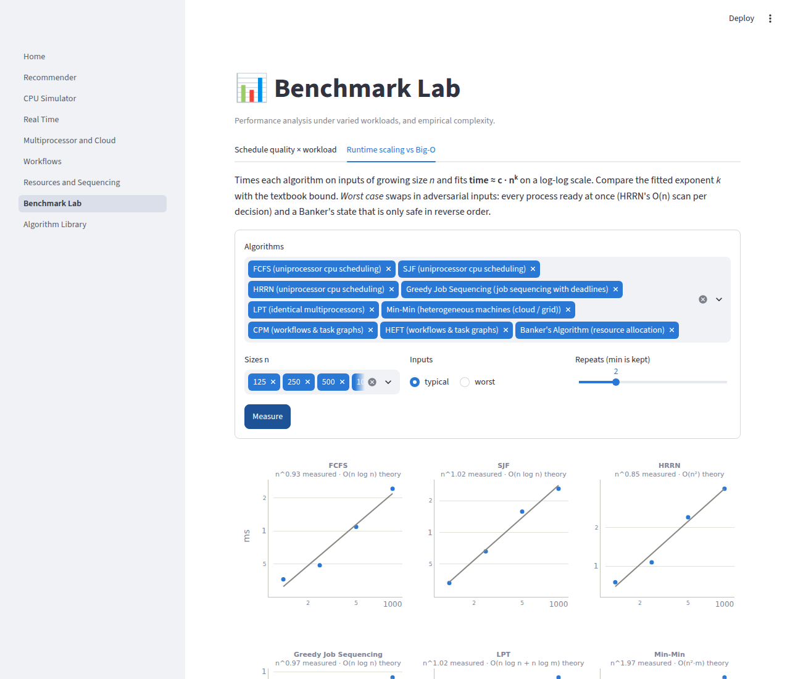
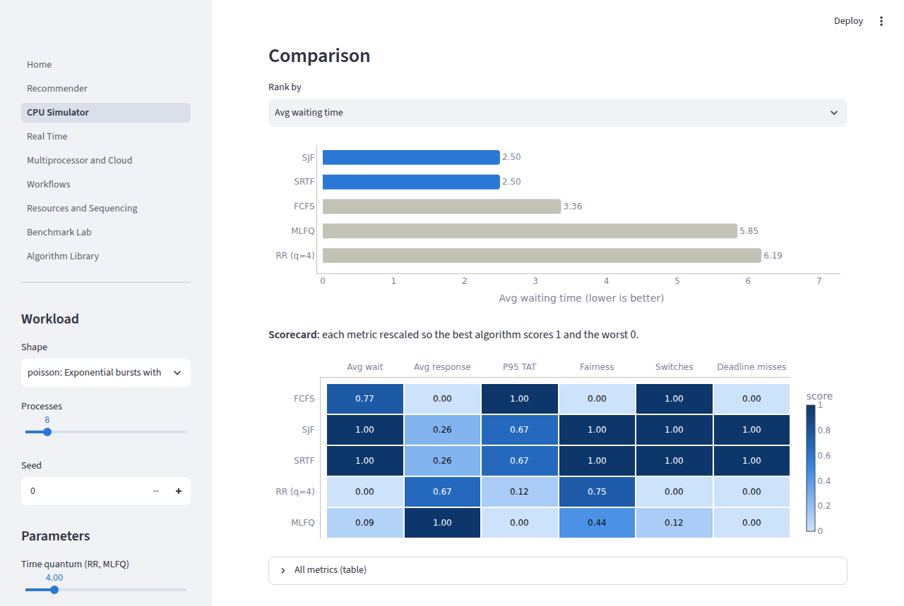
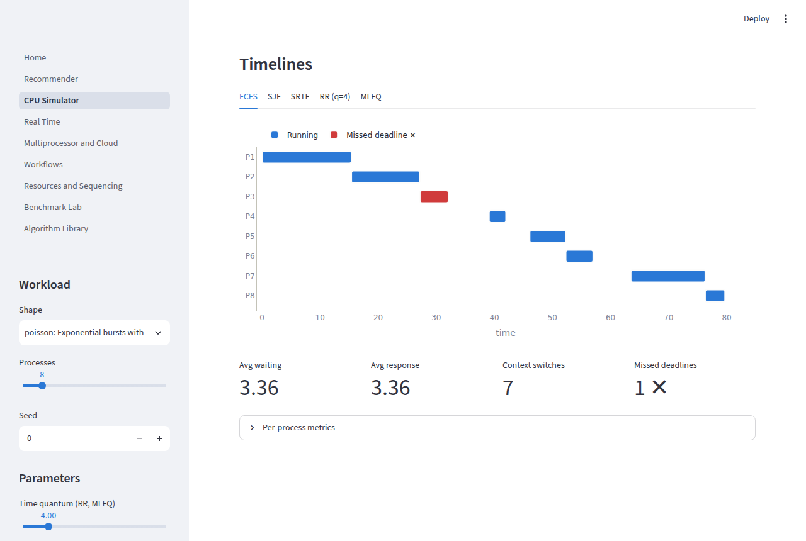
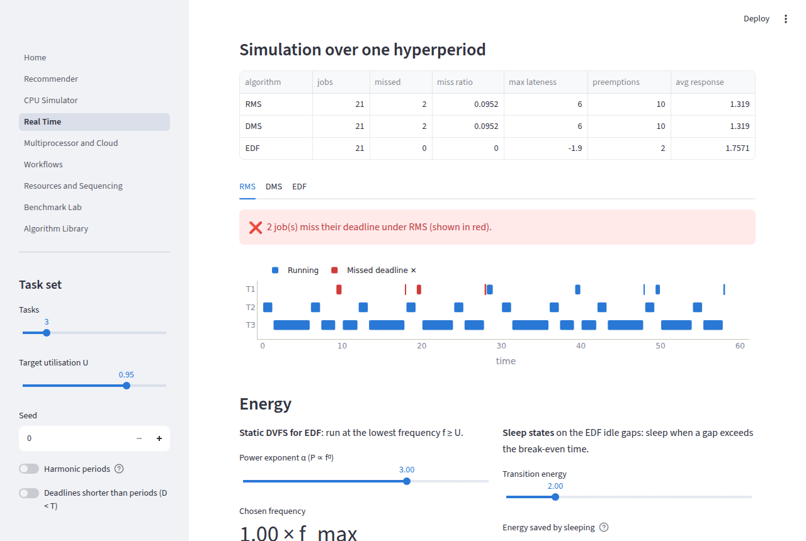
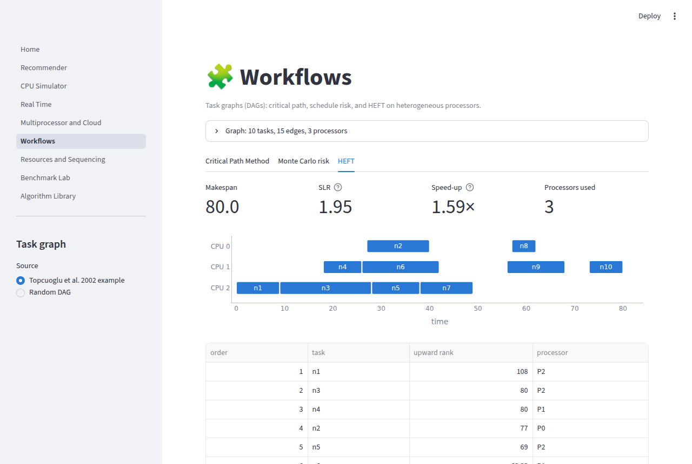

# Algorithmic Solutions for Scheduling Challenges and Performance Analysis under Varied Workloads (DAA)

[](https://github.com/KAUSHAL36977/Algorithmic-Solutions-for-Scheduling-Challenges-and-Performance-Analysis-under-Varied-Workloads-DAA/actions/workflows/ci.yml)

A Design & Analysis of Algorithms project in three parts:

* **Implement**: 25 scheduling algorithms in 8 families. Each uses the data structure that
  achieves its textbook complexity: heaps, deques, disjoint-set union, Kahn's topological sort.
* **Analyse**: simulate the algorithms on six workload shapes and measure waiting,
  turnaround and response time, throughput, utilisation, fairness and deadline misses. A
  separate study times each algorithm at growing input sizes, fits the growth exponent, and
  compares it with the theoretical Big-O.
* **Recommend**: describe a scheduling problem in plain English and get a ranked list of
  algorithms, with a reason for every point of each score. A head-to-head simulation on a
  real workload then checks the picks.

The engine (`schedlab`) is pure Python standard library. A multi-page **Streamlit** app,
a CLI and a test suite of more than 330 tests sit on top of it.



---

## Quick start

```bash
pip install -r requirements.txt          # streamlit, plotly, pandas (the engine needs nothing)
streamlit run app/Home.py                # the web app

python -m schedlab --help                # the CLI
python DAA101.py                         # the original recommender entry point still works
```

Development:

```bash
pip install -r requirements-dev.txt
ruff check . && pytest
```

## What's inside

| Family | Algorithms | Data structure / idea | Complexity |
|---|---|---|---|
| **CPU (uniprocessor)** | FCFS, SJF, SRTF, Round Robin, Priority (± preemption, aging), HRRN, MLFQ, EDF | one event-driven simulator plus a pluggable ready-queue policy | O(n log n); HRRN O(n²) |
| **Periodic real-time** | RMS, DMS, EDF | Liu-Layland and hyperbolic bounds, exact response-time analysis, EDF processor-demand test | O(J log n) per hyperperiod |
| **Job sequencing** | Greedy with deadlines & profits | **DSU** of free slots (instead of an O(n·d) scan) | O(n log n) |
| **Identical multiprocessors** | Graham list scheduling, LPT, work stealing | heap of processor finish times; per-worker deques | O(n log n + n log m) |
| **Heterogeneous (cloud / grid)** | Min-Min, Max-Min | ETC matrix | O(n²·m) |
| **Workflows (DAGs)** | CPM, Monte Carlo CPM, HEFT | Kahn topological sort, upward rank, insertion policy | O(V+E), O(S(V+E)), O(V²P) |
| **Resource allocation** | Banker's (safety + request), max-min fair share | safety check; water-filling | O(n²m), O(n log n) |
| **Energy** | Static DVFS for EDF, break-even sleep scheduling | P ∝ fᵅ energy model | O(n + L), O(g) |

Some implementation notes that matter for the analysis:

* **One simulator for every CPU policy.** Time jumps from event to event (arrival, completion,
  quantum expiry), so the cost scales with the number of events, not with the timeline
  length. It supports a **context-switch cost** parameter, which makes the Round Robin
  quantum trade-off measurable.
* **Priority aging stays O(log n).** Uniform linear aging subtracts the same `a·now` from
  every waiting job, so the static key `priority + a·ready_since` keeps the heap order valid
  without re-keying.
* **Periodic jobs become ordinary processes** (`"T1#3"` is the 4th job of T1). The same
  metrics, charts and tests therefore apply to real-time schedules.

## Verified against the literature

The test suite (`pytest`, 338 tests) checks exact published answers, brute-force optima
and invariants:

| Check | Expected | Source |
|---|---|---|
| FCFS / SJF / RR(q=4) on bursts 24, 3, 3 | avg wait 17 / 3 / 5.67 | Silberschatz et al., *OS Concepts* |
| SRTF on (0,8)(1,4)(2,9)(3,5) | avg wait 6.5 | ″ |
| Non-preemptive priority, 5 processes | avg wait 8.2 | ″ |
| Banker's safe state and requests (grant / wait / unsafe) | safe sequence exists | ″ |
| **HEFT** on the 10-task, 3-processor DAG | makespan **80**, order n1, n3, n4, n2, n5, n6, n9, n7, n8, n10 | Topcuoglu, Hariri & Wu (2002) |
| RMS vs EDF on {(2,5), (4,7)} | RMS misses (R₂ = 8 > 7), EDF meets all | Liu & Layland (1973) |
| Job sequencing on the classic 5 jobs | order c, a, e; profit 142 | Horowitz & Sahni |
| Greedy job sequencing on random instances | equals brute-force optimum | exhaustive search |
| LPT and list scheduling on random instances | within 4/3 − 1/(3m) and 2 − 1/m of brute-force OPT | Graham (1966, 1969) |
| Max-min fair share, capacity 10, demands 2, 2.6, 4, 5 | 2, 2.6, 2.7, 2.7 | Bertsekas & Gallager |
| RTA verdict vs simulated deadline misses | agree on random task sets | exactness of RTA |

The invariants run on every CPU algorithm × workload shape × seed. A CPU never runs two
things at once, nothing runs before it arrives, and every job receives exactly its burst.
SJF is optimal for batch waiting time, and SRTF is never worse than SJF.

## Performance analysis under varied workloads

`python -m schedlab benchmark --sizes 50,100,200 --seeds 5` gives the average waiting time,
as a mean over 3 sizes × 5 seeds at offered load 0.85:

| Algorithm | uniform | poisson | heavy-tailed | bimodal | bursty | batch |
|---|---:|---:|---:|---:|---:|---:|
| FCFS | 26.8 | 40.8 | 29.8 | 48.7 | 94.7 | 609.7 |
| SJF | 18.5 | 19.9 | 17.7 | 22.2 | 65.4 | **438.6** |
| **SRTF** | **17.3** | **15.5** | **5.3** | **12.4** | **63.9** | **438.6** |
| Round Robin (q=4) | 39.1 | 44.2 | 14.1 | 31.1 | 136.2 | 858.8 |
| Priority | 26.6 | 38.5 | 28.6 | 50.1 | 94.0 | 614.5 |
| HRRN | 22.3 | 26.6 | 21.0 | 25.2 | 74.1 | 441.6 |
| MLFQ | 53.7 | 44.1 | 10.9 | 27.9 | 157.0 | 831.1 |
| EDF | 22.6 | 28.7 | 7.4 | 19.6 | 83.7 | 614.6 |

What the numbers show (switch the metric with `--metric avg_response` or `--metric fairness`):

* **SRTF wins average waiting time everywhere**, as the SRPT optimality result predicts, and
  SJF ties it on batch, where the two coincide.
* **Heavy-tailed workloads punish FCFS hardest.** FCFS is 5.6× worse than SRTF there,
  compared with 1.5× on uniform workloads. This is the convoy effect.
* **Response time reverses the ranking.** MLFQ has an average response time of **0.5–1.4**,
  against 27–49 for FCFS, on the uniform, poisson, heavy-tailed and bimodal workloads. Yet
  MLFQ and RR have the two worst waiting times on uniform, poisson and bursty:
  responsiveness costs waiting time.
* **HRRN** stays within 1–34% of SJF on waiting time and has higher fairness (Jain index of
  slowdown) than SJF on every workload, because it ages long jobs instead of starving them.



### Empirical complexity vs Big-O

`python -m schedlab scaling` times each algorithm at n = 250 … 2000 (keeping the best of 3
runs) and fits `time ≈ c·nᵏ` on a log-log scale:

| Algorithm | Theory | Measured k (typical) | Measured k (worst case) |
|---|---|---:|---:|
| SJF / SRTF / Priority / EDF (heap) | O(n log n) | 0.97–1.02 | 1.16 (SJF) |
| Round Robin / MLFQ | O(n log n + B/q) | 1.00 | |
| **HRRN** | **O(n²)** | 0.99 | **1.96** |
| Greedy job sequencing (DSU) | O(n log n) | 1.03 | |
| LPT | O(n log n) | 1.03 | |
| **Min-Min / Max-Min** | **O(n²·m)** | **2.00 / 2.01** | |
| HEFT | O(V²·P) | 1.77 | |
| CPM | O(V + E) | 0.78–1.02 (sub-ms timings, noisy) | |
| **Banker's safety** | **O(n²·m)** | 1.02 | **1.99** |

The typical/worst split is a DAA lesson in itself. HRRN's O(n) scan per decision and
Banker's O(n) passes only appear when the input forces them. For HRRN that means every
process ready at once. For Banker's it means a state that is only safe in reverse order,
so each pass finishes a single process. Typical inputs keep the ready queue short, and
Banker's usually finishes in one or two passes. The `--case worst` flag and the app's
*worst* toggle build those inputs. Measured numbers vary slightly between machines; the
exponents are stable.



## The recommender

The original `DAA101.py` matched raw substrings, so "processor" counted as "process". It
also printed descriptions with no ranking. The new engine works in three steps:

1. **Parse**: whole-word regular expressions with synonyms turn free text into a
   `ProblemProfile`. The profile holds domains, goals (in the order mentioned), features
   such as deadlines, periodic tasks, priorities, dependencies, heterogeneous machines
   and interactive work, whether run times are known, whether preemption is allowed, and
   the processor count.
2. **Score**: every knowledge-base entry earns points for domain fit, how well it serves
   each goal (weighted by priority), and features it handles. It loses points for unmet
   requirements (SJF without known run times), conflicts (a preemptive algorithm when jobs
   can't be interrupted) and known risks (starvation when fairness is a goal). Every point
   carries a **reason**.
3. **Check**: the implemented candidates and a baseline run on a simulated workload and
   are ranked by the primary goal's metric. The ranking can differ from the advice: for a
   hard real-time profile the text scoring favours DMS/RMS for predictability, but at
   U = 0.95 with non-harmonic periods the simulation shows EDF missing 0 deadlines where
   RMS misses 20%.

```text
$ python -m schedlab recommend --evaluate "batch jobs with known runtimes, minimize average waiting time"
1. Shortest Job First (SJF)   match 88%   (O(n log n) with a min-heap ready queue ...)
   ✔ designed for batch jobs
   ✔ excellent for: minimise average waiting / turnaround
   ...
===== DATA-BACKED CHECK: Avg waiting time on 'batch' (lower is better) =====
Winner on this workload: SJF
```

The general-algorithm chatbot from `Alorithmic-Solution-to-all-life-problems.py` (four
near-identical copies that prompted for input on import) is now a single importable
`GeneralAlgorithmAdvisor`. It covers sorting, graphs, strings, knapsack, flows and more,
is available as `python -m schedlab general` and has a tab in the app.

## The web app

| Page | What you can do |
|---|---|
| 🧭 Recommender | Plain-English problem → editable profile → ranked, explained picks → head-to-head simulation |
| 🖥️ CPU Simulator | Edit a process table (or generate one), tune quantum / aging / context-switch cost, compare Gantt charts, ranked metrics and a scorecard |
| ⏱️ Real-Time | Liu-Layland / hyperbolic / RTA / EDF demand verdicts, RMS vs DMS vs EDF timelines with misses in red, DVFS and sleep-state energy |
| 🧮 Multiprocessor & Cloud | List vs LPT vs work stealing against the makespan lower bound; Min-Min vs Max-Min on an editable ETC matrix |
| 🧩 Workflows | CPM with the critical path highlighted, Monte Carlo completion-time distribution and criticality index, HEFT Gantt with SLR and speed-up |
| 🔐 Resources & Sequencing | Banker's safety check and request simulator, weighted max-min fair share, DSU job sequencing |
| 📊 Benchmark Lab | Algorithms × workloads × sizes × seeds heatmap, robustness ranking, winners per workload, CSV export; scaling small multiples with fitted exponents |
| 📚 Algorithm Library | Search and filter all 25 knowledge-base entries |

| | |
|---|---|
|  |  |
|  |  |

Chart design: identity comes from axis labels, never from colour alone. Comparisons
highlight the winner and grey the rest. Missed deadlines use a reserved red with a legend
label. Magnitude grids use a single-hue scale, and cell text switches between black and
white for contrast. The app follows the viewer's light/dark theme.

## CLI reference

```text
python -m schedlab list                                     # every algorithm + complexity
python -m schedlab recommend [TEXT] [--evaluate] [-v]       # explainable recommendations
python -m schedlab general [TEXT]                           # classic algorithm advisor
python -m schedlab simulate --workload heavy_tailed -n 12 --algos fcfs,sjf,rr --gantt --cs 0.5
python -m schedlab realtime -n 3 -u 0.95 --non-harmonic --gantt
python -m schedlab benchmark --sizes 50,100 --seeds 3 --metric avg_response --csv out.csv
python -m schedlab scaling --algos hrrn,bankers --case worst
```

## Project layout

```text
schedlab/                 # engine: pure standard library
  models.py               # Process, PeriodicTask, Job, Slice, Schedule, DAG
  metrics.py              # waiting/turnaround/response, throughput, utilisation, Jain fairness, misses
  workloads.py            # seeded generators: uniform, poisson, heavy_tailed, bimodal, bursty, batch,
                          #   UUniFast task sets, ETC matrices, random DAGs, the HEFT paper DAG
  benchmark.py            # workload benchmark, scaling study, log-log complexity fit, CSV
  cli.py                  # python -m schedlab ...
  algorithms/             # cpu, realtime, sequencing, multiprocessor, cloud, workflow, resource, energy
                          #   + REGISTRY (the single list the CLI, app and benchmark read)
  recommender/            # knowledge_base, engine (parse → score → check), general (legacy advisor)
app/                      # Streamlit: Home.py + pages/, charts.py (Plotly), common.py
tests/                    # 338 tests: textbook values, brute-force optimality, invariants, CLI, app pages
DAA101.py                 # original entry point, now a thin wrapper around the new recommender
```

## Adding an algorithm

1. Implement it in the right `schedlab/algorithms/<family>.py` so it returns a `Schedule`.
   For a CPU policy, subclass `Policy` and pass it to `simulate`.
2. Register it in `schedlab/algorithms/__init__.py` with its complexity and knowledge-base name.
3. Add or extend its `AlgorithmInfo` in `schedlab/recommender/knowledge_base.py`.

The CLI, benchmark, recommender check and app pages all read the registry, and the
parametrised invariant tests cover a new CPU policy automatically.
